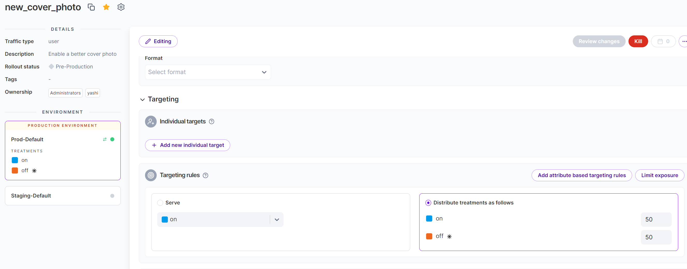

# Split sample app walkthrough

## Prerequisites

1. Create a Split.io account
2. Create a Split.io organization
3. Create a workspace (or use the default workspace) under the organization.

## Create feature flags

The sample web app uses three feature flags:
1. new_cover_photo:

    - Feature: show a new cover photo.
    - Treatment: on (50%) / off (50%)

2. survey_incentive: 

    - Feature: show a new survey description with more incentive for survey participation.
    - Treatment: on (50%) / off (50%)

3. large_cover_photo: 

    - Feature: increase the size of the cover photo.
    - Treatment: on (50%) / off (50%)
    - Dynamic configuration: on (photo height 400 pixels) / off (photo height 150 pixels)

Login [Split portal](https://app.split.io/) and creates the feature flags following the below configuration.

### Feature flag: new_cover_photo

Treatments:


Targeting rules:



### Feature flag: survey_incentive

Treatments:


Targeting rules:


### Feature flag: large_cover_photo

Treatments:


Dynamic configuration:


Targeting rules:


## Run the sample web app

The sample web app uses Split [.NET server-side SDK](https://help.split.io/hc/en-us/articles/360020240172--NET-SDK) to retrieve feature flags from Split and emit events to Split. It requires a Split server-side API key to authenticate with Split API.

From `Admin settings`, copy the server-side SDK API key corresponding to the same environment where the feature flags are created.


Save the API key in a secret file under the path `%APPDATA%\Microsoft\UserSecrets\a3e3f50b-3bee-4110-b6a5-d57e5ff7c17c\secrets.json` with the following format:

```
{
  "Splitio:ApiKey": "<Split_API_Key>"
}
```
Run the solution to launch both the sample web app and the test program. The test program mocks a group of users visiting the sample web app and optionally participating the survey of the app by rating the page with a score from 1-5. Impressions and events are then sent by the sample app to Split.

### Test logic

The test program runs in a loop. Each iteration starts with GET the main page of the sample app and parses the returned HTML. The parsed survey introduction and cover photo determines the next step of the mock user:

1. If the survey introduction is the `on` treatment of the feature `survey_incentive` ("with the chance to win $1000"), the mock user will always (100% chance) participate the survey. Otherwise (`off` treatment of `survey_incentive`) the mock user will have 50% chance to participate the survey.
2. If the mock user decides to participate the survey, he will rate the page based on the cover photo. If the cover photo is the `on` treatment of the feature `new_cover_photo`, the mock user will give a score between 3-5 randomly. Otherwise (`off` treatment of `new_cover_photo`) the mocker user will give a score between 1-3 randomly.
3. The photo size determined by the feature `large_cover_photo` does not impact the survey participation or score.

### Impressions

The sample web app sents an [impression](https://help.split.io/hc/en-us/articles/360020585192-Impressions) to Split for every feature evaluation. Each impression includes `split` as the feature flag name, `key` as the user ID, `treatment` as the evaluated result of the feature flag, `timestamp` and other required metadata. A sample impression is shown below.

```
{
  "environmentId": "a26b5d00-6ec2-11ee-aebf-ee919197fded",
  "environmentName": "Prod-Default",
  "key": "user_73",
  "label": "default rule",
  "machineIp": "172.21.112.1",
  "machineName": "DESKTOP-68UF13O",
  "receptionTimestamp": 1700118643260,
  "sdk": ".NET_CORE",
  "sdkVersion": "7.6.0",
  "split": "new_cover_photo",
  "splitVersionNumber": 1699482602361,
  "timestamp": 1700118359326,
  "trafficTypeId": "a2619900-6ec2-11ee-aebf-ee919197fded",
  "trafficTypeName": "user",
  "treatment": "on"
}
```

### Events

The sample web app sents an [event](https://help.split.io/hc/en-us/articles/360020585772-Events) to Split for each survey participation. Each event includes `eventTypeId` as `image_rating`, `key` as the user ID, `value` as the score the user rates the web page, `timestamp` and other required metadata to attribute the event to impressions. A sample event is shown below.

```
{
  "environmentId": "a26b5d00-6ec2-11ee-aebf-ee919197fded",
  "environmentName": "Prod-Default",
  "eventTypeId": "image_rating",
  "key": "user_842",
  "machineIp": "172.21.112.1",
  "machineName": "DESKTOP-68UF13O",
  "properties": {},
  "receptionTimestamp": 1700117500557,
  "sdk": ".NET_CORE",
  "sdkVersion": "7.6.0",
  "timestamp": 1700117499436,
  "trafficTypeId": "a2619900-6ec2-11ee-aebf-ee919197fded",
  "trafficTypeName": "user",
  "value": 2
}
```

## Create metrics

Two metrics are created to evaluation the impact of the feature flags

The metric `survey_score` evaluates the average score per user with the desired impact as `increase`.


The metric `survey_participation` evaluates the count of the events (the number of survey participations) per user with the desired impact also as `increase`.


## Review experimentation results

The impact of a feature flag on the metrics can be viewed from the `Metrics impact` tab of the feature flag.


The feature flag `new_cover_photo` shows a desired impact of increasing `survey_score`, while its impact on `survey_participation` is inconclusive.


Note that `survey_score` is set as a key metric for the `new_cover_photo` feature, but all metrics are calculated for the feature flag regardless of being key metrics or not.

In contrast, the feature flag `survey_incentive` shows a desired impact of increasing `survey_participation`, while its impact on `survey_score` is inconclusive.


Finally, the feature flag `large_cover_photo` shows inconclusive impact on both metrics `survey_score` and `survey_participation`.


## Query impressions and events from data hub

Split's data hub supports querying the raw events and impressions.

Events from the experimentation


Impressions from the experimentation


